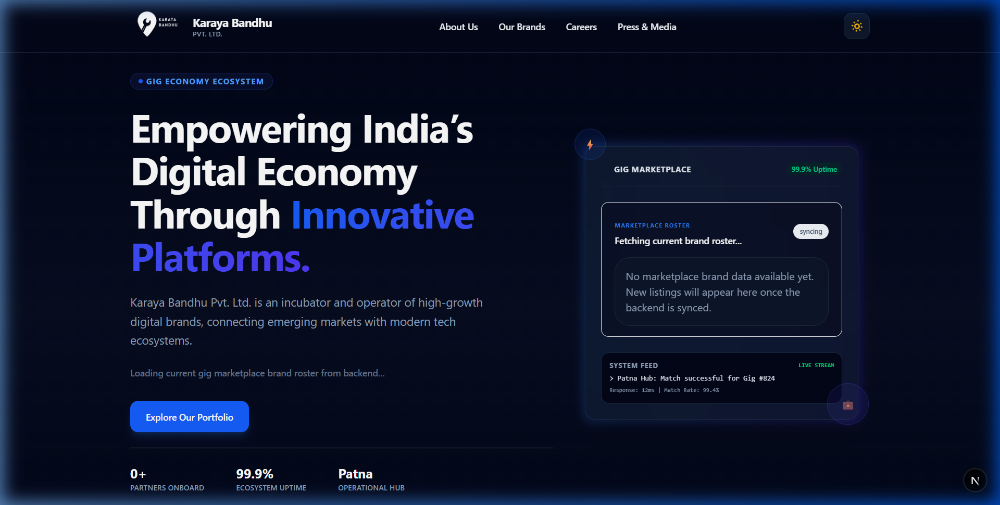
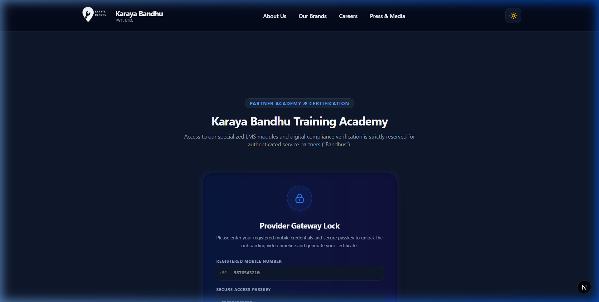
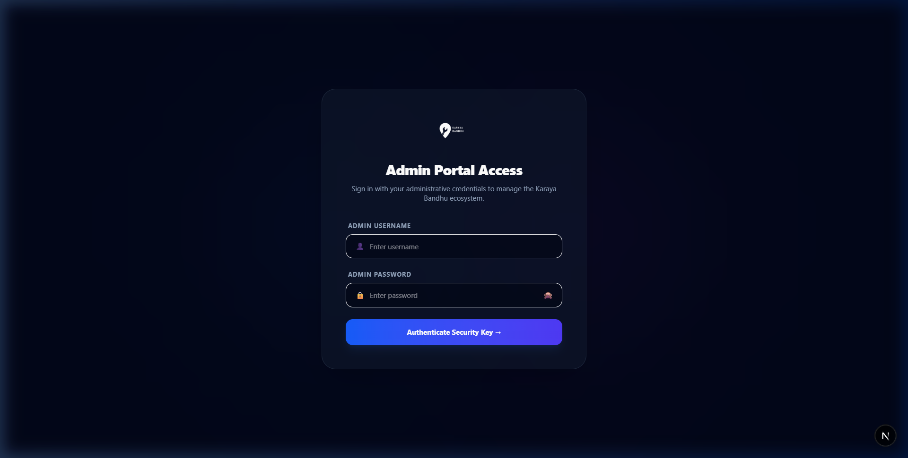

# 🚀 Karaya Bandhu - Corporate Portfolio & Management Platform

A modern, full-stack enterprise web application for **Karaya Bandhu Pvt. Ltd.** built with **Next.js 16 (App Router)**, **React 19**, **Tailwind CSS v4**, and **MongoDB (Mongoose)**.

---

## 📸 Application Previews

### 🌐 Corporate Portal & Gig Marketplace


### 🏢 Incubated Brands & Partner Training Academy


### 🔐 Secure Admin Management Portal


---

## 🛠️ How to Run This Project

Follow the steps below to set up and run the project on your local machine:

### Step 1: Clone or Unzip the Project
Clone the repository using Git or unzip the downloaded project folder:
```bash
git clone https://github.com/aniket99-1/Karaya-Bandhu---Portfolio-.git
```

### Step 2: Navigate to the Project Directory
Open your terminal and enter the project folder where `package.json` is located:
```bash
cd "Karayabandhu Pvt Ltd project"
```

### Step 3: Setup Environment Variables
Create a **`.env.local`** file inside `Karayabandhu Pvt Ltd project/` (at the same level where `package.json` is located):

```bash
# You can copy from .env.example
cp .env.example .env.local
```

Open `.env.local` and configure the following environment variables:

```env
# MongoDB Database Connection String
MONGODB_URI=mongodb://127.0.0.1:27017/karayabandhu

# Admin Portal Access Credentials
ADMIN_USERNAME=kbadmin
ADMIN_PASSWORD=your_secure_password_here

# JWT Secret Key for Authentication Tokens
ADMIN_SECRET=your_jwt_secret_key_here
```

> **📌 Note:**
> - **MongoDB Setup**: Make sure MongoDB is installed and running locally, or use a [MongoDB Atlas](https://www.mongodb.com/atlas) cloud connection string (`mongodb+srv://...`).
> - **Admin Credentials**: Choose your desired `ADMIN_USERNAME` and `ADMIN_PASSWORD` to log into the Admin Portal (`/admin`).
> - **JWT Secret Key**: Set a long, secure random string for `ADMIN_SECRET` to sign session tokens securely.

### Step 4: Install Dependencies
Run the command below to install all required Node.js packages:
```bash
npm install
```

### Step 5: Run the Project
Start the development server:
```bash
npm run dev
```

Once started, open your browser and navigate to:
- **🌐 Public Web Portal:** [http://localhost:3000](http://localhost:3000)
- **🔒 Admin Dashboard:** [http://localhost:3000/admin](http://localhost:3000/admin)

---

## 📦 Available Scripts

| Command | Description |
| :--- | :--- |
| `npm run dev` | Starts the Next.js development server with hot-reloading on port `3000` |
| `npm run build` | Builds the optimized production application bundle |
| `npm start` | Starts the production server after building |
| `npm run lint` | Runs ESLint to check for code quality and style issues |

---

## 🌟 Key Features & Modules

- **🏢 Corporate Landing Page & Showcase:** High-converting landing pages featuring Hero, Services, Mission, Vision, and Press Releases.
- **🎓 Partner Academy & Provider Onboarding:** Interactive onboarding application modal for prospective partners and service professionals.
- **💼 Career Opportunities & ATS:** Dynamic job listings and candidate application tracking with resume upload support.
- **🔐 Admin Management Dashboard (`/admin`):**
  - Secure JWT authentication with protected routes and cookie management.
  - Candidate Hub (ATS) to view and manage applicant profiles.
  - Job management (Post, edit, and archive vacancies).
  - Press release editor and partner brand asset manager.
- **⚡ Next.js Full-Stack Architecture:** Integrated frontend components and backend API endpoints (`/app/api/*`) in a single performant codebase.

---

## 📁 Project Structure

```text
Karayabandhu Pvt Ltd project/
├── app/
│   ├── admin/               # Admin Portal UI (Dashboard, Candidate ATS, Jobs)
│   ├── api/                 # Full-stack backend API routes (Next.js server handlers)
│   │   ├── academy/         # Academy endpoints
│   │   ├── admin/           # Authentication & login API
│   │   ├── applications/    # Candidate & Onboarding submissions API
│   │   ├── jobs/            # Job board CRUD API
│   │   ├── press/           # Press release management API
│   │   └── upload-resume/   # Resume upload handler
│   ├── components/          # Reusable UI & Section components (Hero, Academy, Jobs, etc.)
│   ├── lib/                 # Shared database (Mongoose) & JWT Auth utilities
│   ├── globals.css          # Global Tailwind CSS styles
│   └── page.js              # Main Landing Page entry
├── public/
│   ├── screenshots/         # UI preview screenshots for README
│   └── ...                  # Static assets, logos, and icons
├── .env.example             # Example environment variables template
├── .env.local               # Local environment configuration (do not commit secrets)
├── package.json             # Project dependencies and npm scripts
└── README.md                # Project documentation
```

---

## 🛡️ License

This project is proprietary and maintained by **Karaya Bandhu Pvt. Ltd.**
